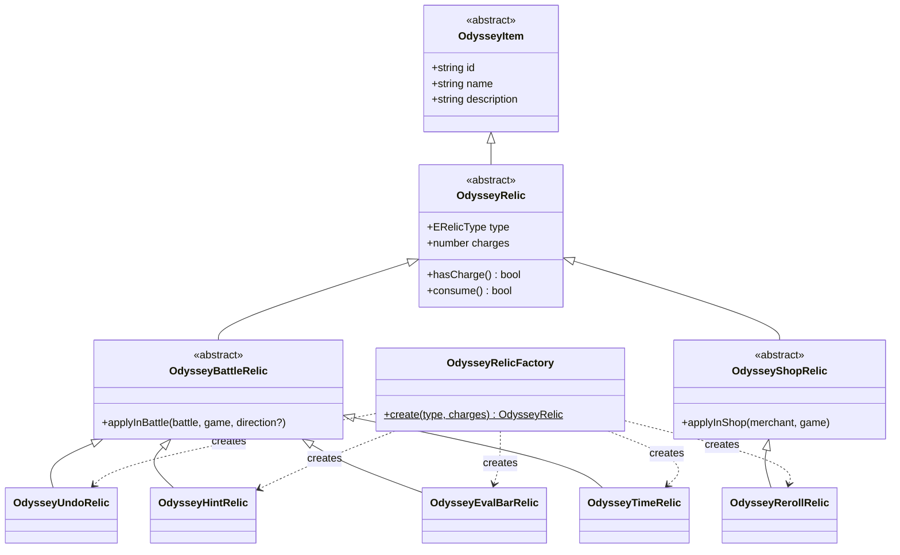
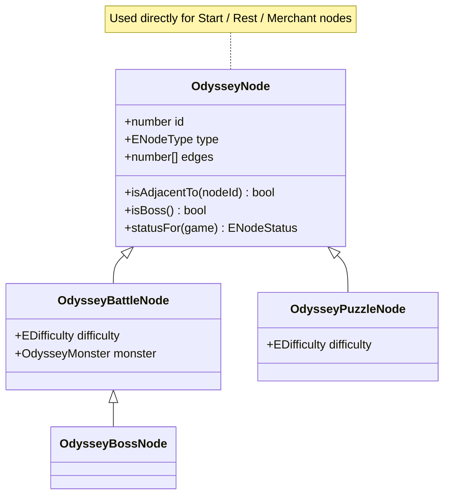
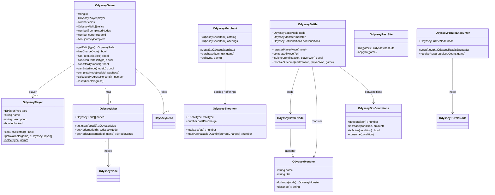

# Odyssey / Story Mode — Model Layer

Domain model for the Odyssey (Story Mode) backend: an abstract root class
per hierarchy, concrete subclasses that each carry real data or behavior,
and `E`-prefixed enum files for closed vocabularies.

This is the model layer — properties, method signatures, class
relationships, and their behavior. No persistence layer; nothing here
queries or writes to a database.

```
enums/    9 enum files
models/   24 classes
tests/
  unit/       one test file per model class
  support/    shared test factories
```

## Classes

### Item / Relic hierarchy

A relic is something a run equips and spends charges of. Each concrete
relic owns its own effect — nothing outside the class needs to know *how*
a relic works, only that it can be applied.

| Class | Role |
|---|---|
| `OdysseyItem` | Abstract root — id, name, description. Anything a run can own. |
| `OdysseyRelic` | Abstract — adds `type` and `charges`, plus `hasCharge()` / `consume()`. |
| `OdysseyBattleRelic` | Abstract — a relic used mid-battle (`applyInBattle`). |
| `OdysseyShopRelic` | Abstract — a relic used inside the shop (`applyInShop`). |
| `OdysseyUndoRelic`, `OdysseyHintRelic`, `OdysseyEvalBarRelic`, `OdysseyTimeRelic` | Concrete battle relics — each implements its own `applyInBattle`. |
| `OdysseyRerollRelic` | Concrete shop relic — implements `applyInShop`. |
| `OdysseyRelicFactory` | Builds the right concrete relic for an `ERelicType`. Separate from `OdysseyRelic` itself to avoid a circular import (the abstract base would otherwise need to import every concrete subclass, each of which imports it back). |



### Node hierarchy

A node is a point on the run map. `OdysseyNode` is concrete and used
directly for Start/Rest/Merchant nodes, which carry no data beyond their
type. `OdysseyBattleNode` and `OdysseyPuzzleNode` subclass it because they
carry real extra fields.

| Class | Role |
|---|---|
| `OdysseyNode` | Concrete base — id, type, position, edges, `isAdjacentTo()`, `isBoss()`, `statusFor(game)`. |
| `OdysseyBattleNode` | Adds `difficulty` and `monster`. Used for enemy/elite/boss nodes. |
| `OdysseyBossNode` | Extends `OdysseyBattleNode` — the one boss node; victory sets `journeyComplete`. |
| `OdysseyPuzzleNode` | Adds `difficulty`. |



### Core classes

`OdysseyPlayer` represents *who* is playing — the Knight, the Bishop, the
Rook — not the run itself. `OdysseyGame` is the run: one save slot's
state, holding which `OdysseyPlayer` was chosen, the generated map, the
economy, and progress. Every other class that mutates run state
(`OdysseyBattle`, `OdysseyMerchant`, `OdysseyRestSite`,
`OdysseyPuzzleEncounter`) takes an `OdysseyGame`, not an `OdysseyPlayer`.

Compound rules that would otherwise be re-derived at each call site are
named, single-source-of-truth predicates on the class that owns their
data — the same pattern as `Session.isActive()`/`User.canLogin()`:
`OdysseyNode.isBoss()` (used by both `OdysseyBattle` and `OdysseyMonster`,
which used to each check `type === ENodeType.Boss` separately),
`OdysseyBattle.isVictory()` (checkmate + player-won, not just any win),
and `OdysseyGame.canAfford()` / `canAcquireRelic()` (used by
`OdysseyMerchant.purchase()` instead of inline coin/slot checks).

| Class | Role |
|---|---|
| `OdysseyPlayer` | A player identity (character) — e.g. the Knight. `getAvailable()`/`select()` handle the roster and unlock rules. |
| `OdysseyGame` | The run/save-slot state. Owns `player`, `map`, `relics[]`, coins, and progress; guard methods like `canEnterNode()`, `hasCharge()`, `canAfford()`, `canAcquireRelic()`. |
| `OdysseyMap` | Holds `OdysseyNode[]`; generates and looks up node status. |
| `OdysseyMonster` | A battle opponent's display profile; `forNode()` picks one deterministically. |
| `OdysseyBattle` | A live battle session — clocks + `OdysseyBotConditions`. |
| `OdysseyBotConditions` | Confused / Relaxed / Distracted meters, with `get`/`increase`/`isActive`/`consume`. |
| `OdysseyMerchant` | A shop visit — priced catalog and current offerings. |
| `OdysseyShopItem` | A single purchasable listing — `totalCost()`, `maxPurchasableQuantity()`. |
| `OdysseyRestSite` | A rest-site roll and its application to the run. |
| `OdysseyPuzzleEncounter` | A puzzle-solving session opened against a puzzle node. |



## Why enums, not string-literal types

A TypeScript string union (`type ERelicType = "undo" | "hint" | ...`)
would give nearly identical compile-time safety — that's not the deciding
factor. Real `enum` was used for two reasons:

1. **Matches the original UML example** — the first diagram shared had an
   explicit `<<enum>>` stereotype box for `Article State`. A TypeScript
   `enum` reads the same way in a class diagram: a closed, named
   vocabulary, distinct from a data-bearing class.
2. **One canonical runtime object** — `Object.values(ERelicType)` gives
   every valid value in one place for iteration/validation; a type-only
   string union leaves no trace at runtime.

| Enum | Values |
|---|---|
| `ERelicType` | Undo, Hint, EvalBar, Time, Reroll |
| `ENodeType` | Start, Enemy, Elite, Boss, Puzzle, Rest, Merchant |
| `ENodeStatus` | Locked, Available, Active, Completed |
| `EDifficulty` | Beginner, Easy, Intermediate, Advanced, Master |
| `EBattleEndReason` | Checkmate, Timeout, Draw |
| `EBattleResult` | Victory, Defeat |
| `EBotCondition` | Confused, Relaxed, Distracted |
| `ETimeDirection` | IncreasePlayerClock, DecreaseEnemyClock |
| `EPlayerType` | Knight, Bishop, Rook, Strategist |

## Unit tests

`tests/unit/` mirrors `models/` one file per class (`OdysseyGame.ts` →
`OdysseyGame.test.ts`), covering every meaningful method — happy path,
edge cases (empty inventory, zero charges, locked nodes, insufficient
coins), and the boundary conditions each method's own logic creates
(clock floors, charge caps, all-or-nothing rewards). `tests/support/`
holds shared test factories (`makeGame`, `makeBattle`) used across files.

Tests use Node's built-in test runner (`node:test` / `node:assert`) with
one `describe` block per class and `test_methodName_scenario` names, so a
failing test's name alone says what broke. Run them with:

```
npx tsx --test story-mode-backend-models/tests/unit/*.test.ts
```

167 tests, all passing.
