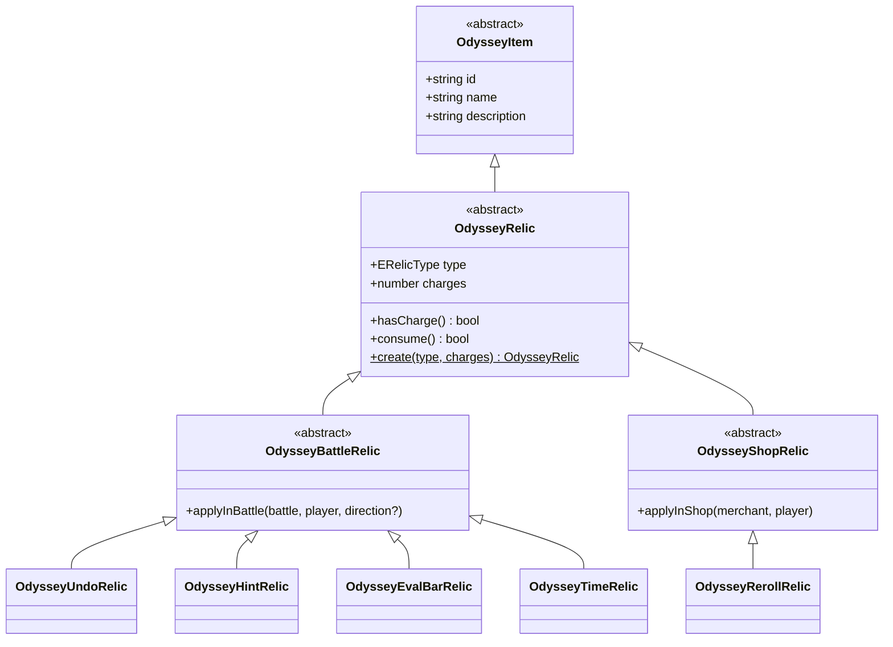
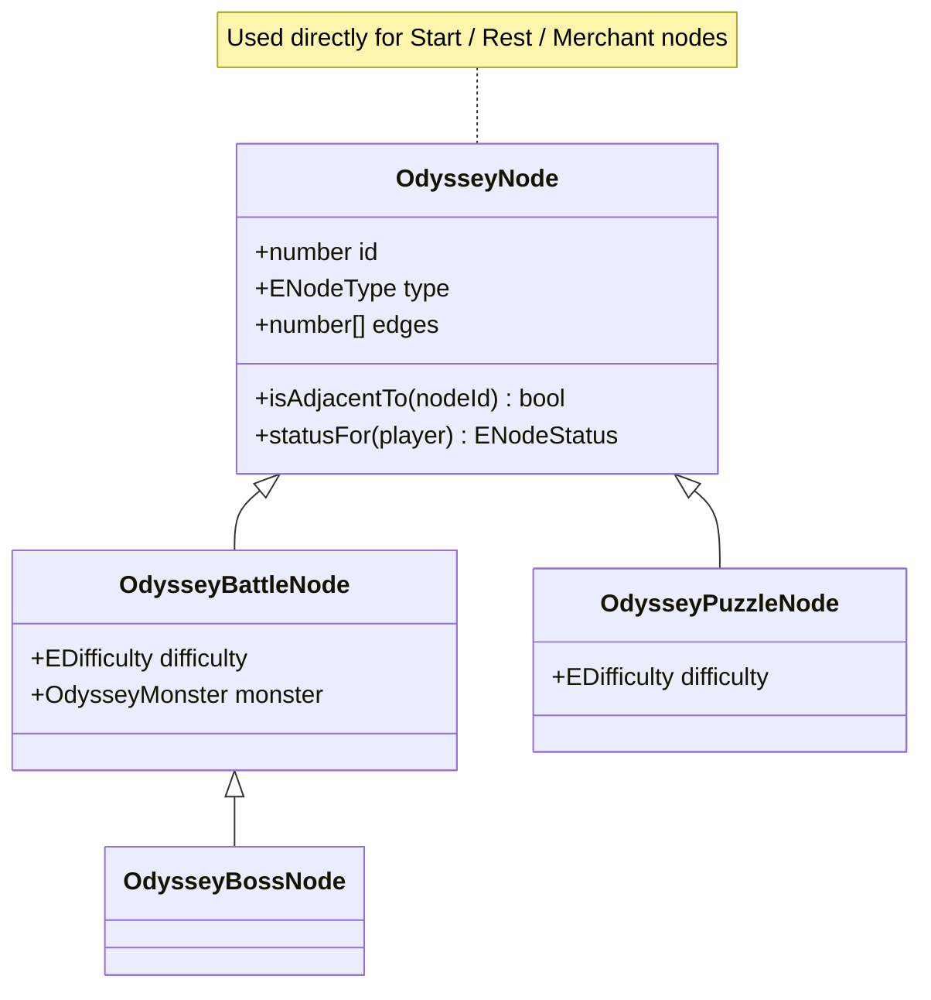
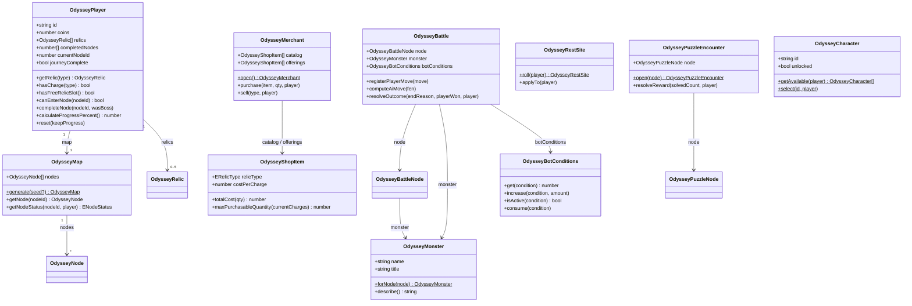

# Odyssey / Story Mode — Model Layer

Domain model for the Odyssey (Story Mode) backend, 
an abstract root class per hierarchy,
concrete subclasses that each carry real data or behavior, and
`E`-prefixed enum files for closed vocabularies.

This is the model layer only — properties, method signatures, and class
relationships. No method bodies, no persistence/repository layer.

```
enums/    8 enum files
models/   23 classes
```

## Classes

### Item / Relic hierarchy

A relic is something the player equips and spends charges of. Each
concrete relic owns its own effect — nothing outside the class needs to
know *how* a relic works, only that it can be applied.

| Class | Role |
|---|---|
| `OdysseyItem` | Abstract root — id, name, description. Anything a player can own. |
| `OdysseyRelic` | Abstract — adds `type` and `charges`, plus `hasCharge()` / `consume()`. |
| `OdysseyBattleRelic` | Abstract — a relic used mid-battle (`applyInBattle`). |
| `OdysseyShopRelic` | Abstract — a relic used inside the shop (`applyInShop`). |
| `OdysseyUndoRelic`, `OdysseyHintRelic`, `OdysseyEvalBarRelic`, `OdysseyTimeRelic` | Concrete battle relics — each implements its own `applyInBattle`. |
| `OdysseyRerollRelic` | Concrete shop relic — implements `applyInShop`. |



### Node hierarchy

A node is a point on the run map. `OdysseyNode` is concrete and used
directly for Start/Rest/Merchant nodes, which carry no data beyond their
type. `OdysseyBattleNode` and `OdysseyPuzzleNode` subclass it because they
carry real extra fields.

| Class | Role |
|---|---|
| `OdysseyNode` | Concrete base — id, type, position, edges, `isAdjacentTo()`, `statusFor(player)`. |
| `OdysseyBattleNode` | Adds `difficulty` and `monster`. Used for enemy/elite/boss nodes. |
| `OdysseyBossNode` | Extends `OdysseyBattleNode` — the one boss node; victory sets `journeyComplete`. |
| `OdysseyPuzzleNode` | Adds `difficulty`. |



### Core classes

| Class | Role |
|---|---|
| `OdysseyPlayer` | The save-slot record. Owns `map`, `relics[]`, coins, and progress; guard methods like `canEnterNode()`, `hasCharge()`. |
| `OdysseyMap` | Holds `OdysseyNode[]`; generates and looks up node status. |
| `OdysseyMonster` | A battle opponent's display profile; `forNode()` picks one deterministically. |
| `OdysseyBattle` | A live battle session — clocks + `OdysseyBotConditions`. |
| `OdysseyBotConditions` | Confused / Relaxed / Distracted meters, with `get`/`increase`/`isActive`/`consume`. |
| `OdysseyMerchant` | A shop visit — priced catalog and current offerings. |
| `OdysseyShopItem` | A single purchasable listing — `totalCost()`, `maxPurchasableQuantity()`. |
| `OdysseyRestSite` | A rest-site roll and its application to the player. |
| `OdysseyPuzzleEncounter` | A puzzle-solving session opened against a puzzle node. |
| `OdysseyCharacter` | Character list and selection. |



## Why enums, not string-literal types

A TypeScript string union (`type ERelicType = "undo" | "hint" | ...`)
would give nearly identical compile-time safety — that's not the deciding
factor. Real `enum` was used for three reasons:
 
1. **Matches the original UML example** — the first diagram shared had an
   explicit `<<enum>>` stereotype box for `Article State`. A TypeScript
   `enum` reads the same way in a class diagram: a closed, named
   vocabulary, distinct from a data-bearing class.
2. **One canonical runtime object** — `Object.values(ERelicType)` gives
   every valid value in one place for iteration/validation; a type-only
   string union leaves no trace at runtime.

| Enum | Values |
|---|---|
| `ERelicType` | Undo, Hint, EvalBar, Time, Reroll |
| `ENodeType` | Start, Enemy, Elite, Boss, Puzzle, Rest, Merchant |
| `ENodeStatus` | Locked, Available, Active, Completed |
| `EDifficulty` | Beginner, Easy, Intermediate, Advanced, Master |
| `EBattleEndReason` | Checkmate, Timeout, Draw |
| `EBattleResult` | Victory, Defeat |
| `EBotCondition` | Confused, Relaxed, Distracted |
| `ETimeDirection` | IncreasePlayerClock, DecreaseEnemyClock |
